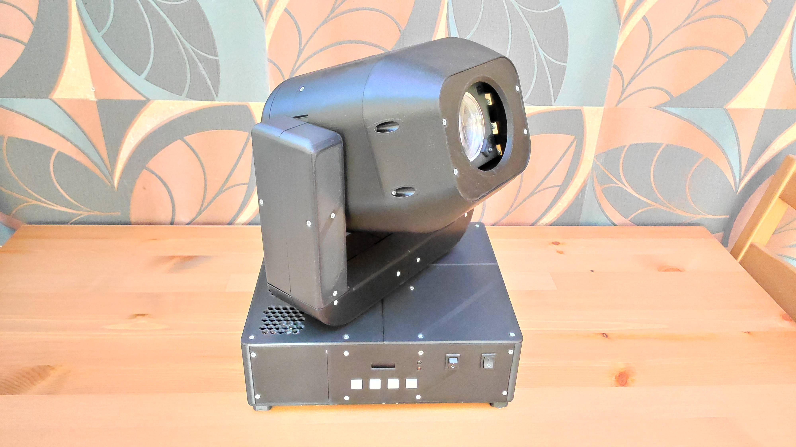

# DIY-Moving-head-light

## Table of contents
- [English description](#english-description)
    - [Overview](#overview)
    - [Introduction](#introduction)
    - [Mechanical and Electronic Implementation](#mechanical-and-electronic-implementation)
    - [Software Implementation](#software-implementation)
    - [Results and Advantages](#results-and-advantages)
    - [Conclusion](#conclusion)
- [Magyar leírás](#magyar-leírás)
    - [Bevezetés](#bevezetés)
    - [Mechanikai és elektronikai megvalósítás](#mechanikai-és-elektronikai-megvalósítás)
    - [Szoftveres megvalósítás](#szoftveres-megvalósítás)
    - [Eredmények és előnyök](#eredmények-és-előnyök)
    - [Befejezés](#befejezés)

## English description
### Overview
I made a functional moving head light by using 3D printing, CAD modelling, PCB designing and laser cutting tools as a student. And I wanted to share the technical detail and source files of this projetc so everyone can acces it.

### Introduction
In general, robotic lights are lighting technology devices used for stage illumination. They are extremely widespread tools today, found on every stage from rural theaters to the most sophisticated international concerts. The goal of this project was to create a robotic light that possesses functionality similar to professional devices, while simultaneously prioritizing learning and gaining experience. Among the devices used in stage technology, the robotic light I implemented can be categorized as a moving head spot light. In simpler terms, it's a moving head spot light with motorized zoom and focus functions. The term "moving head" refers to the lamp's head being able to rotate robotically along two axes via remote control. The term "spot light" refers to the shape of the lamp's projected image, while "motorized zoom" means that the size of the projected spot can be remotely and motorically reduced or enlarged.

### Mechanical and Electronic Implementation
The robotic light was designed using SolidWorks CAD design software, then fabricated using FDM 3D printing and diode laser cutting. The frame structure consists of M6 threaded rods and 3D printed support elements. The electrical system is based on two printed circuit boards containing ESP32 and Atmega328p microcontrollers. Function control is primarily done via the DMX512 protocol, but manual control is also possible.

### Software Implementation
The robotic light has three microcontrollers that communicate with each other through a communication system. The program code was written in ArduinoIDE, and its main task is the coordinated control of the hardware based on external control signals. The ESP32 microcontroller module used is capable of both Bluetooth and WiFi communication, which allows for future developments.

### Results and Advantages
The robotic light is functionally similar to its market competitors, but the emphasis is on the transparency of the device's operation, thereby facilitating learning. My project can provide an excellent opportunity for technical school students or university students studying engineering to examine, build, or further develop such a complex device. The device's components are easily obtainable and replaceable, and the circuit design is student-friendly. To make my project accessible to others, I intend to share the complete technical documentation online in the future, thus making my project open-source.

### Conclusion
The project's goal was to create a complex, yet primarily learning-oriented robotic light that aids in understanding the operation of sophisticated equipment used in the stage technology industry. Through open-source sharing, the project could contribute to technical school and university education by providing a project that students can build themselves, making it more interesting and exciting.

## Magyar leírás
### Bevezetés
A robotlámpák általánosságban, színpadi megvilágításra használt, fénytechnikai eszközök. Napjainkban rendkívül elterjedt eszközöknek számítanak, megtalálhatóak a vidéki színházaktól a legszínvonalasabb nemzetközi koncertekig bezáróan az összes színpadon. A projekt célja egy olyan robotlámpa megvalósítása volt, amely a professzionális eszközökhöz hasonló funkcionalitással rendelkezik, ugyanakkor a tanulást és a tapasztalat szerzést helyezi előtérbe. A színpadtechnikában használt eszközökön belül az általam megvalósított robotlámpa a moving head spot light kategóriába sorolható be. Magyarul megfogalmazva mozgó fejű folt-pötty lámpa motorizált kicsinyítés-nagyítás funkcióval. A mozgó fejű kifejezés arra utal, hogy a lámpának a fejét két tengely mentén, távezérléssel robotizáltan lehet forgatni, a folt-pötty kifejezés a lámpa vetítési képének a formájára utal, míg a motorizált kicsinyítés-nagyítás azt jelenti, hogy távezérléssel, motorizáltan lehet a vetített folt-pötty méretét kicsinyíteni vagy nagyítani.

### Mechanikai és elektronikai megvalósítás
A robotlámpa tervezése Solidworks CAD tervező szoftverben történt, majd FDM 3D nyomtatással és diódás lézervágással valósult meg. A vázszerkezet M6-os menetes rudakból és 3D nyomtatott tartóelemekből áll. Az elektromos rendszer alapját két nyomtatott áramköri panel képezi, amelyek ESP32 és Atmega328p mikrokontrollereket tartalmaznak. A funkciók vezérlése DMX512 protokollon keresztül történik, de manuális vezérlés is lehetséges.

### Szoftveres megvalósítás
A robotlámpa három mikrokontrollerrel rendelkezik, amelyek kommunikációs rendszeren keresztül kommunikálnak egymással. A programkód ArduinoIDE-ben íródott, fő feladata a külső vezérlő jel alapján a hardver összehangolt irányítása. A felhasznált ESP32-es mikrokontroller modul Bluetooth és WiFi kommunikációra is képes, ami jövőbeli fejlesztéseket tesz lehetővé.

### Eredmények és előnyök
A robotlámpa funkcionálisan hasonló a piaci versenytársakhoz, de a hangsúly az eszköz működésének az átláthatóságán, ezáltal a tanuláson van. A projektem kiváló lehetőséget biztosíthat technikumi tanulók vagy műszaki egyetemen hallgatóknak egy ilyen bonyolult eszköz tanulmányozásához, megépítéséhez vagy tovább gondolásához. Az eszköz alkatrészei könnyen beszerezhetőek és cserélhetőek, az áramkörök tervezése tanulóbarát. Ahhoz, hogy mások is hozzáférjenek a projektemhez a jövőben megosztanám az interneten a teljeskörű műszaki dokumentációt, ezáltal nyílt forráskódúvá téve a projektemet.

### Befejezés
A projekt célja egy olyan komplex, mégis elsősorban tanulási célú robotlámpa létrehozása volt, amely a színpadtechnikai iparban használatos bonyolult eszközök működésének megértését segíti. A nyílt forráskódú megosztás révén a projekt hozzájárulhatna a technikumi és egyetemi oktatáshoz, egy olyan projekttel, amit a diákok maguk is elkészíthetnek ezáltal érdekesebbé és izgalmasabbá téve azt.
